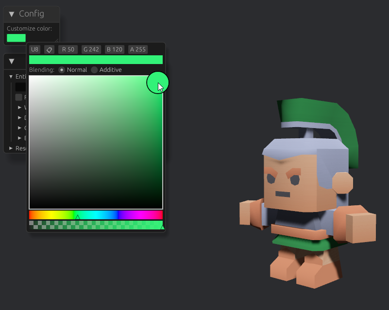

# My game for the Bevy Jam #5

This is my jet untitled entry for the [Bevy Jam #5](https://itch.io/jam/bevy-jam-5)

🚀 [Play the web version on GitHub](https://brookman.github.io/bevy-game-jam-5/) 🚀

## Screenshot

## About the game

...

## Attribution
Thanks to [kenny.nl](https://kenney.nl/assets/mini-arena) for providing free game assets.
